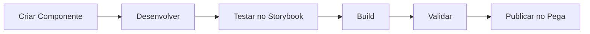

<div align="center">

# 🎨 Pega Constellation DX Components

### Custom Components Portfolio for Pega Platform

[](https://www.pega.com/)
[](https://reactjs.org/)
[](https://www.typescriptlang.org/)
[](https://styled-components.com/)

*Repositório de componentes customizados desenvolvidos para Pega Constellation DX Platform*

[Sobre](#-sobre) • 
[Componentes](#-componentes-disponíveis) • 
[Instalação](#-instalação-e-configuração) • 
[Desenvolvimento](#-desenvolvimento) • 
[Documentação](#-documentação)

</div>

---

## 📖 Sobre

Este repositório contém uma coleção de **componentes customizados** desenvolvidos para o **Pega Constellation DX Component Builder**. O objetivo é expandir as capacidades nativas da plataforma Pega, oferecendo componentes visuais e funcionais que podem ser reutilizados em diferentes aplicações.

### 🎯 Objetivos do Projeto

- 🔧 **Extensibilidade**: Criar componentes que não existem nativamente no Pega
- 🎨 **Customização**: Oferecer alta personalização através de propriedades configuráveis
- 📦 **Reusabilidade**: Componentes modulares prontos para uso em qualquer aplicação Pega
- 🚀 **Performance**: Código otimizado e seguindo as melhores práticas
- 📱 **Responsividade**: Design adaptável para diferentes dispositivos

### 💼 Portfólio

Este projeto serve como portfólio profissional demonstrando capacidades em:
- Desenvolvimento de componentes React/TypeScript
- Integração com Pega Platform
- Design de interfaces customizadas
- Arquitetura de componentes reutilizáveis

---

## 🧩 Componentes Disponíveis

### 1. Digital Clock Widget

<div align="center">
  
</div>

Um relógio digital moderno e totalmente customizável que exibe hora e data em tempo real.

**🎯 Especificações Técnicas:**
- **Tipo**: Widget
- **Biblioteca**: DXExtensions
- **Framework**: React 17 + TypeScript
- **Atualização**: Real-time (1s interval)

**✨ Características:**
- ⏰ Atualização automática em tempo real
- 🎨 Gradiente de cores totalmente customizável
- 📅 Data por extenso em português (pt-BR)
- 🔄 Suporte a formatos 12h e 24h
- 📱 Design responsivo e compacto
- ⚡ Performance otimizada com hooks React

**⚙️ Propriedades Configuráveis:**

| Propriedade | Tipo | Padrão | Descrição |
|------------|------|--------|-----------|
| `label` | Text | "Digital Clock" | Texto do label |
| `format24Hour` | Boolean | `false` | Formato 12h ou 24h |
| `showSeconds` | Boolean | `true` | Exibir segundos |
| `showDate` | Boolean | `true` | Exibir data por extenso |
| `backgroundColor1` | Text (Hex) | `#667eea` | Cor inicial do gradiente |
| `backgroundColor2` | Text (Hex) | `#764ba2` | Cor final do gradiente |
| `textColor` | Text (Hex) | `#ffffff` | Cor do texto |

**📝 Exemplo de Uso:**
```javascript
// Configuração no Pega Constellation
{
  "format24Hour": false,
  "showSeconds": true,
  "showDate": true,
  "backgroundColor1": "#667eea",
  "backgroundColor2": "#764ba2",
  "textColor": "#ffffff"
}
```

---

## 🚀 Instalação e Configuração

### ✅ Pré-requisitos

| Ferramenta | Versão Requerida | Recomendada |
|-----------|------------------|-------------|
| Pega Infinity Server | 24.2+ | 24.2+ |
| Node.js | 18 ou 20 | 20 |
| npm | 8 ou 10 | 10 |
| Git | 2.30+ | Latest |

> ⚠️ **Importante**: npm versão 9 não é suportada

### 📁 Estrutura do Projeto

```bash
ConstellationDXComponentsPegaPlatform/
│
├── 📂 sldxcomponents/              # Diretório principal
│   ├── 📂 src/
│   │   └── 📂 components/          # Componentes customizados
│   │       ├── Sl_DXExtensions_DigitalClock/
│   │       │   ├── index.tsx       # Componente React
│   │       │   ├── config.json     # Configuração Pega
│   │       │   ├── styles.ts       # Styled Components
│   │       │   ├── mock.ts         # Dados de teste
│   │       │   └── demo.stories.tsx
│   │       └── _components.md
│   │
│   ├── 📂 keys/                    # Certificados SSL
│   │   ├── dxcb.crt
│   │   └── dxcb.key
│   │
│   ├── 📂 .storybook/              # Configuração Storybook
│   ├── 📄 package.json             # Dependências
│   ├── 📄 tasks.config.json        # Configuração servidor Pega
│   ├── 📄 build.config.json        # Configuração de build
│   └── 📄 tsconfig.json            # Configuração TypeScript
│
├── 📂 docs/                        # Documentação e assets
│   └── digital-clock-demo.png
│
└── 📄 README.md                    # Este arquivo
```

### ⚙️ Configuração Inicial

#### 1️⃣ Clone o Repositório

```bash
git clone https://github.com/jguerradasilva/ConstellationDXComponentsPegaPlatform.git
cd ConstellationDXComponentsPegaPlatform/sldxcomponents
```

#### 2️⃣ Instale as Dependências

```bash
npm install
```

#### 3️⃣ Configure o Servidor Pega

Edite o arquivo `tasks.config.json` com as configurações do seu ambiente:

```json
{
  "components-directory-path": "src/components",
  "import-relative-path": "Downloads",
  "export-relative-path": "Downloads",
  "server-config": {
    "rulesetName": "SLConstellationDXComponents",
    "rulesetVersion": "01-01-01",
    "sourceOfComponents": "Server",
    "devBuild": true,
    "serverType": "infinity",
    "server": "https://localhost:1080/prweb",
    "clientId": "10095186356008396159",
    "grantType": "authCode",
    "redirectUri": "https://localhost:4010/",
    "authService": "pega",
    "cert": "./keys/dxcb.crt",
    "key": "./keys/dxcb.key"
  },
  "component": {
    "library": "DXExtensions",
    "type": "",
    "version": "1.0.0",
    "subtype": "",
    "description": "",
    "icon": ""
  }
}
```

#### 4️⃣ Configure os Certificados SSL

Coloque seus certificados SSL na pasta `keys/`:
- `dxcb.crt` - Certificado SSL
- `dxcb.key` - Chave privada SSL

#### 5️⃣ Autentique com o Servidor Pega

```bash
npm run authenticate
```

---

## 💻 Desenvolvimento

### Comandos Disponíveis

#### 🔐 Autenticação
```bash
npm run authenticate              # Autenticar com servidor Pega
```

#### 📦 Gerenciamento de Componentes
```bash
npm run list                      # Listar componentes locais
npm run create                    # Criar novo componente
npm run createAll                 # Criar todos os componentes
npm run rename                    # Renomear componente
npm run delete                    # Deletar componente
npm run deleteAll                 # Deletar todos os componentes
```

#### 🔨 Build e Validação
```bash
npm run buildComponent            # Build de componente específico
npm run buildAllComponents        # Build de todos os componentes
npm run validate-schema           # Validar schema do componente
npm run lint                      # Executar linter
```

#### 🚀 Publicação
```bash
npm run publish                   # Publicar componente no servidor Pega
npm run publishAll                # Publicar todos os componentes
```

#### 📥 Import/Export
```bash
npm run importComponent           # Importar componente do servidor
npm run update                    # Atualizar componente existente
```

#### 🎨 Desenvolvimento Visual
```bash
npm run startStorybook            # Iniciar Storybook (porta 6040)
```

### Workflow de Desenvolvimento



1. **Criar**: `npm run create` - Gera estrutura base do componente
2. **Desenvolver**: Implementar lógica e estilos
3. **Testar**: `npm run startStorybook` - Visualizar componente
4. **Build**: `npm run buildComponent` - Compilar componente
5. **Validar**: `npm run validate-schema` - Validar configuração
6. **Publicar**: `npm run publish` - Deploy no servidor Pega

## 📝 Guia Completo: Criando Componentes do Zero

### 🎯 Passo 1: Criando um Novo Projeto (Do Zero)

Se você está começando um projeto completamente novo, execute:

```bash
# Criar novo projeto DX Components
npx @pega/custom-dx-components@~24.2 init

# Responda as perguntas:
# - Project name: nome-do-seu-projeto
# - Organization: SuaOrganizacao
# - Description: Descrição do projeto
# - Author: Seu Nome

# Entre no diretório criado
cd nome-do-seu-projeto

# Instale as dependências
npm install
```

Isso criará toda a estrutura necessária para desenvolver componentes Pega Constellation.

**OU** se você quer usar este repositório como base:

```bash
# Clone o repositório
git clone https://github.com/jguerradasilva/ConstellationDXComponentsPegaPlatform.git
cd ConstellationDXComponentsPegaPlatform/sldxcomponents

# Instale as dependências
npm install
```

---

### 🎯 Passo 2: Configuração do Ambiente

#### 2.1 Configure o tasks.config.json

Edite o arquivo `tasks.config.json` com as informações do seu servidor Pega:

```json
{
  "components-directory-path": "src/components",
  "server-config": {
    "rulesetName": "SLConstellationDXComponents",
    "rulesetVersion": "01-01-01",
    "serverType": "infinity",
    "server": "https://localhost:1080/prweb",
    "clientId": "seu-client-id",
    "grantType": "authCode",
    "redirectUri": "https://localhost:4010/",
    "authService": "pega",
    "cert": "./keys/dxcb.crt",
    "key": "./keys/dxcb.key"
  }
}
```

#### 2.2 Configure Certificados SSL

Coloque seus certificados na pasta `keys/`:
- `dxcb.crt` - Certificado SSL
- `dxcb.key` - Chave privada

#### 2.3 Autentique com o Servidor

```bash
npm run authenticate
```

---

### 🛠️ Passo 3: Criando um Novo Componente

#### 3.1 Gerar Estrutura Base

```bash
npm run create
```

Responda as perguntas:
- **Component name**: `Sl_DXExtensions_MeuComponente`
- **Type**: Escolha entre `Field`, `Widget`, ou `Template`
- **Library**: `DXExtensions`

#### 3.2 Estrutura de Arquivos Gerada

```
src/components/Sl_DXExtensions_MeuComponente/
├── index.tsx              # Componente React principal
├── config.json            # Configuração Pega
├── styles.ts              # Estilos (Styled Components)
├── mock.ts                # Dados mock para testes
├── PConnProps.d.ts        # TypeScript definitions
├── create-nonce.ts        # Segurança CSP
└── demo.stories.tsx       # Storybook (opcional)
```

---

### 📋 Passo 4: Configurando o Componente

#### 4.1 Edite o config.json

Defina as propriedades e metadados do componente:

```json
{
  "name": "Sl_DXExtensions_MeuComponente",
  "label": "Meu Componente",
  "description": "Descrição do que o componente faz",
  "organization": "Sl",
  "version": "1.0.0",
  "library": "DXExtensions",
  "componentKey": "Sl_DXExtensions_MeuComponente",
  "type": "Widget",
  "subtype": ["PAGE", "CASE"],
  "properties": [
    {
      "name": "title",
      "label": "Título",
      "format": "TEXT",
      "defaultValue": "Título Padrão"
    },
    {
      "name": "showDetails",
      "label": "Mostrar Detalhes",
      "format": "BOOLEAN",
      "defaultValue": true
    },
    {
      "name": "backgroundColor",
      "label": "Cor de Fundo",
      "format": "TEXT",
      "defaultValue": "#ffffff"
    },
    {
      "name": "visibility",
      "label": "Visibilidade",
      "format": "VISIBILITY"
    }
  ],
  "defaultConfig": {
    "title": "Título Padrão",
    "showDetails": true,
    "backgroundColor": "#ffffff"
  }
}
```

**Tipos de Propriedades:**
- `TEXT` - Campo de texto
- `BOOLEAN` - Checkbox true/false
- `NUMBER` - Campo numérico
- `SELECT` - Lista dropdown
- `VISIBILITY` - Controle de visibilidade
- `DISABLED` - Controle de habilitação

---

### 💻 Passo 5: Implementando o Componente

#### 5.1 Edite o index.tsx

```typescript
import { useState, useEffect } from 'react';
import { withConfiguration } from '@pega/cosmos-react-core';
import type { PConnProps } from './PConnProps';
import './create-nonce';
import StyledWrapper from './styles';

// Interface das propriedades
interface MeuComponenteProps extends PConnProps {
  title?: string;
  showDetails?: boolean;
  backgroundColor?: string;
  testId?: string;
}

// Componente principal
function MeuComponente(props: MeuComponenteProps) {
  const { 
    title = 'Título Padrão',
    showDetails = true,
    backgroundColor = '#ffffff',
    testId 
  } = props;
  
  const [contador, setContador] = useState(0);

  useEffect(() => {
    // Lógica de inicialização
    console.log('Componente montado');
    
    return () => {
      // Cleanup
      console.log('Componente desmontado');
    };
  }, []);

  const handleClick = () => {
    setContador(contador + 1);
  };

  return (
    <StyledWrapper 
      data-testid={testId}
      $backgroundColor={backgroundColor}
    >
      <h2>{title}</h2>
      {showDetails && (
        <div className="details">
          <p>Contador: {contador}</p>
          <button onClick={handleClick}>Incrementar</button>
        </div>
      )}
    </StyledWrapper>
  );
}

export default withConfiguration(MeuComponente);
```

#### 5.2 Edite o styles.ts

```typescript
import styled, { css } from 'styled-components';

interface StyledProps {
  $backgroundColor?: string;
}

export default styled.div<StyledProps>(({ $backgroundColor = '#ffffff' }) => {
  return css`
    padding: 20px;
    background-color: ${$backgroundColor};
    border-radius: 8px;
    box-shadow: 0 2px 8px rgba(0, 0, 0, 0.1);
    
    h2 {
      color: #333;
      margin-bottom: 16px;
      font-size: 24px;
    }
    
    .details {
      margin-top: 16px;
      
      p {
        color: #666;
        font-size: 16px;
        margin-bottom: 12px;
      }
      
      button {
        padding: 8px 16px;
        background-color: #007bff;
        color: white;
        border: none;
        border-radius: 4px;
        cursor: pointer;
        
        &:hover {
          background-color: #0056b3;
        }
      }
    }
  `;
});
```

---

### 🧪 Passo 6: Testando o Componente

#### 6.1 Testar no Storybook

```bash
npm run startStorybook
```

Acesse: `http://localhost:6040`

#### 6.2 Validar Schema

```bash
npm run validate-schema
```

#### 6.3 Build do Componente

```bash
npm run buildComponent
```

Selecione o componente e escolha se quer build de desenvolvimento.

---

### 🚀 Passo 7: Publicando no Pega

#### 7.1 Build Final

```bash
npm run buildComponent
# Selecione seu componente
# Escolha "No" para development build (para produção)
```

#### 7.2 Publicar

```bash
npm run publish
# Selecione o componente para publicar
```

#### 7.3 Verificar no Pega

1. Acesse o Pega Dev Studio
2. Vá em **Configure** > **User Interface** > **Component**
3. Procure por seu componente
4. Use em qualquer View ou Screen Flow

---

### 🔧 Passo 8: Atualizando Componentes

#### Atualizar Versão

```json
// config.json
{
  "version": "1.1.0"  // Incrementar versão
}
```

#### Rebuild e Republish

```bash
npm run buildComponent
npm run publish
```

---

### 📊 Passo 9: Boas Práticas

#### ✅ Do's
- ✅ Sempre validar o schema antes do build
- ✅ Testar no Storybook antes de publicar
- ✅ Usar TypeScript para type safety
- ✅ Seguir convenção de nomenclatura: `Org_Library_ComponentName`
- ✅ Documentar propriedades no config.json
- ✅ Usar styled-components para estilos
- ✅ Implementar cleanup no useEffect
- ✅ Versionar adequadamente (semver)

#### ❌ Don'ts
- ❌ Não hardcodar valores que podem ser configuráveis
- ❌ Não usar inline styles
- ❌ Não esquecer de passar props corretamente
- ❌ Não publicar sem testar
- ❌ Não usar console.log em produção
- ❌ Não criar dependências circulares

---

### 🐛 Troubleshooting Comum

#### Erro: "Invalid schema"
```bash
npm run validate-schema
# Verificar config.json
```

#### Erro: "Cannot authenticate"
```bash
# Verificar tasks.config.json
# Verificar certificados SSL
npm run authenticate
```

#### Erro: "Build failed"
```bash
# Verificar erros TypeScript
npm run lint
# Verificar imports
```

#### Componente não aparece no Pega
```bash
# Verificar se foi publicado
npm run list
# Republicar
npm run publish
```

---

### 📚 Tipos de Componentes

#### Widget
Para componentes visuais standalone (gráficos, relógios, displays)
```json
{
  "type": "Widget",
  "subtype": ["PAGE", "CASE"]
}
```

#### Field
Para campos de formulário (inputs, selects, etc)
```json
{
  "type": "Field",
  "subtype": "Text"
}
```

#### Template
Para layouts e estruturas
```json
{
  "type": "Template",
  "subtype": "Container"
}
```

---

## 🛠️ Stack Tecnológica

| Tecnologia | Versão | Uso |
|-----------|--------|-----|
|  | 17.0.2 | Framework UI |
|  | 5.3.3 | Type Safety |
|  | 5.3.11 | CSS-in-JS |
|  | 7.6.19 | Component Dev |
|  | 29.7.0 | Testing |
|  | 8.57.0 | Code Quality |
|  | 3.3.3 | Code Format |

### 📦 Dependências Principais

```json
{
  "@pega/cosmos-react-core": "^7.7.0",
  "@pega/custom-dx-components": "~24.2.20",
  "react": "^17.0.2",
  "styled-components": "^5.3.11",
  "typescript": "~5.3.3"
}
```

---

## 📚 Documentação e Recursos

### 📖 Documentação Oficial
- [Pega DX Component Builder](https://docs.pega.com/bundle/constellation-dx-components/page/constellation-dx-components/custom-components/whats-new-constellation-dx-component-builder.html)
- [Pega Constellation](https://docs.pega.com/bundle/constellation/page/constellation/constellation/constellation-overview.html)
- [Cosmos React Components](https://design.pega.com/cosmos-react/)

### 🎓 Recursos de Aprendizado
- [React Documentation](https://react.dev/)
- [TypeScript Handbook](https://www.typescriptlang.org/docs/)
- [Styled Components Docs](https://styled-components.com/docs)

---

## 🤝 Contribuindo

Contribuições são bem-vindas! Siga os passos:

1. Fork o projeto
2. Crie uma branch para sua feature (`git checkout -b feature/AmazingFeature`)
3. Commit suas mudanças (`git commit -m 'Add some AmazingFeature'`)
4. Push para a branch (`git push origin feature/AmazingFeature`)
5. Abra um Pull Request

---

## 📄 Licença

Este projeto está sob a licença especificada no arquivo `LICENSE`.

---

## 👤 Autor

**Desenvolvido por:** [@jguerradasilva](https://github.com/jguerradasilva)

### 📬 Contato

- GitHub: [@jguerradasilva](https://github.com/jguerradasilva)
- LinkedIn: [Seu LinkedIn]
- Email: [Seu Email]

---

## 📊 Status do Projeto


---

<div align="center">

### ⭐ Se este projeto foi útil, considere dar uma estrela!

**Versão**: 1.0.0 | **Última Atualização**: Dezembro 2025

</div>