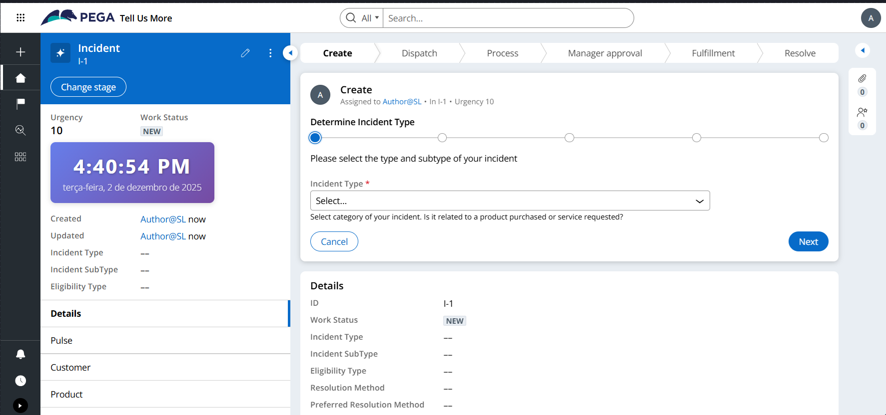
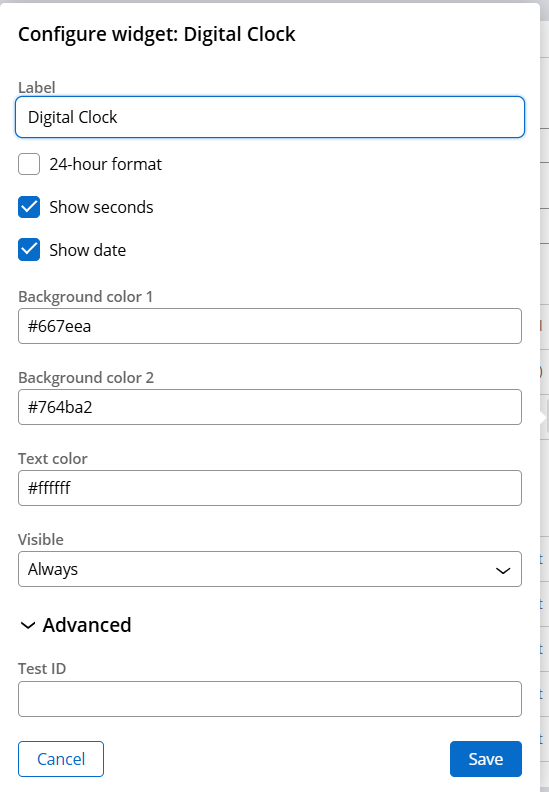
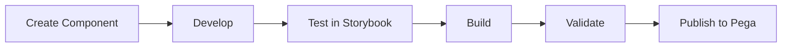

<div align="center">

# 🎨 Pega Constellation DX Components

### Custom Components Portfolio for Pega Platform

[](https://www.pega.com/)
[](https://reactjs.org/)
[](https://www.typescriptlang.org/)
[](https://styled-components.com/)

*Custom components repository developed for Pega Constellation DX Platform*

[About](#-about) • 
[Components](#-available-components) • 
[Installation](#-installation-and-setup) • 
[Development](#-development) • 
[Documentation](#-documentation)

</div>

---

## 📖 About

This repository contains a collection of **custom components** developed for **Pega Constellation DX Component Builder**. The goal is to expand the native capabilities of the Pega platform, offering visual and functional components that can be reused across different applications.

### 🎯 Project Goals

- 🔧 **Extensibility**: Create components that don't exist natively in Pega
- 🎨 **Customization**: Offer high customization through configurable properties
- 📦 **Reusability**: Modular components ready for use in any Pega application
- 🚀 **Performance**: Optimized code following best practices
- 📱 **Responsiveness**: Adaptive design for different devices

### 💼 Portfolio

This project serves as a professional portfolio demonstrating expertise in:
- React/TypeScript component development
- Pega Platform integration
- Custom interface design
- Reusable component architecture

---

## 🧩 Available Components

### 1. Digital Clock Widget

<div align="center">
  <table>
    <tr>
      <td></td>
      <td></td>
    </tr>
  </table>
</div>

A modern, fully customizable digital clock that displays time and date in real-time.

**🎯 Technical Specifications:**
- **Type**: Widget
- **Library**: DXExtensions
- **Framework**: React 17 + TypeScript
- **Update**: Real-time (1s interval)

**✨ Features:**
- ⏰ Automatic real-time updates
- 🎨 Fully customizable color gradient
- 📅 Full date display in Portuguese (pt-BR)
- 🔄 Support for 12h and 24h formats
- 📱 Responsive and compact design
- ⚡ Optimized performance with React hooks

**⚙️ Configurable Properties:**

| Property | Type | Default | Description |
|----------|------|---------|-------------|
| `label` | Text | "Digital Clock" | Label text |
| `format24Hour` | Boolean | `false` | 12h or 24h format |
| `showSeconds` | Boolean | `true` | Show seconds |
| `showDate` | Boolean | `true` | Show full date |
| `backgroundColor1` | Text (Hex) | `#667eea` | Gradient start color |
| `backgroundColor2` | Text (Hex) | `#764ba2` | Gradient end color |
| `textColor` | Text (Hex) | `#ffffff` | Text color |

**📝 Usage Example:**
```javascript
// Pega Constellation configuration
{
  "format24Hour": false,
  "showSeconds": true,
  "showDate": true,
  "backgroundColor1": "#667eea",
  "backgroundColor2": "#764ba2",
  "textColor": "#ffffff"
}
```

---

### 2. Sticky Notes Widget

> ⚠️ **PREREQUISITE REQUIRED**: You must create the `.StickyNotes` Page List in Pega **BEFORE** adding this widget to your view. See [Setup Instructions](#-setup-in-pega) below.

<div align="center">
  
</div>

A complete sticky notes widget with CRUD operations, customizable colors, and automatic persistence to Pega Runtime.

**🎯 Technical Specifications:**
- **Type**: Widget
- **Library**: DXExtensions
- **Framework**: React 17 + TypeScript
- **Persistence**: Automatic sync with Pega Page List

**✨ Features:**
- 📝 Create, edit, and delete notes
- 🎨 6 customizable color options
- 👤 Automatic user tracking (pxCreateOperator - Pega standard)
- 📅 Timestamp on each note (pxCreateDateTime - Pega standard)
- 💾 Auto-save to Pega Runtime (`.StickyNotes` Page List)
- 📱 Responsive grid layout
- 🔒 Read-only mode support
- ⚡ Real-time state synchronization
- ✅ Uses Pega standard properties with custom Page List

**⚙️ Configurable Properties:**

| Property | Type | Default | Description |
|----------|------|---------|-------------|
| `label` | Text | "Sticky Notes" | Widget title |
| `value` | Text | ".StickyNotes" | Page List property path (@baseclass) |
| `readOnly` | Boolean | `false` | Enable/disable editing |
| `visibility` | Visibility | Visible | Control visibility |
| `testId` | Text | - | Test automation ID |

**📊 Data Structure (Page List):**

The component uses a custom **Page List `.StickyNotes`** (type `@baseclass`):

```javascript
.StickyNotes = [
  {
    pyNote: "Review requirements document",
    pxCreateOperator: "john.doe@company.com",
    pxCreateDateTime: "2025-12-10T10:30:00.000Z",
    pyDescription: "#FFE082",
    pyGUID: "note_1733839800000_abc123"
  }
]
```

**Property Details:**
- `pyNote` (String) - Note content text
- `pxCreateOperator` (String) - User who created the note (Pega standard)
- `pxCreateDateTime` (DateTime) - Creation timestamp (Pega standard)
- `pyDescription` (String) - Note color in hex format
- `pyGUID` (String) - Unique identifier (Pega standard)

**🎨 Available Colors:**
- 🟨 Yellow (`#FFE082`) - Default
- 🟩 Green (`#A5D6A7`)
- 🟦 Blue (`#90CAF9`)
- 🟪 Pink (`#F48FB1`)
- 🟪 Purple (`#CE93D8`)
- 🟧 Orange (`#FFAB91`)

**🔌 Pega Runtime Integration:**

The component automatically integrates with Pega using `.StickyNotes` Page List:
```javascript
// Update .StickyNotes Page List
getPConnect().getActionsApi().updateFieldValue('.StickyNotes', updatedNotes)

// Trigger change event
getPConnect().getActionsApi().triggerFieldChange('.StickyNotes', updatedNotes)

// Get current user
window.PCore.getUserApi().getOperatorName()
```

**📝 Setup in Pega:**

> ⚠️ **IMPORTANT**: Complete Step 1 BEFORE adding the widget to your view!

**Step 1: Create the Page List (REQUIRED FIRST)**

1. Open your Case Type or Data Type in Pega
2. Go to **Data model** section
3. Click **+ Add field**
4. Configure the Page List:
   - **Property name**: `StickyNotes`
   - **Type**: **Page List**
   - **Page Class**: **@baseclass**
5. Add the following properties to the Page List:
   - `pyNote` (Text) - note content
   - `pxCreateOperator` (Text) - creator (Pega standard property)
   - `pxCreateDateTime` (DateTime) - timestamp (Pega standard property)
   - `pyDescription` (Text) - color in hex format
   - `pyGUID` (Text) - unique identifier
6. **Save** the data model

**Step 2: Add Widget to View**

1. Open your View in App Studio
2. Drag a **Widget** component onto the canvas
3. Select `Sl_DXExtensions_StickyNotes` from the widget list
4. Configure the widget properties:
   - **Label**: "My Notes" (or your preferred title)
   - **Value**: `.StickyNotes` (must match the Page List name created in Step 1)
   - **Read Only**: `false` (or `true` for read-only mode)
5. **Save** and test the view

**Step 3: Usage Example**
```json
{
  "label": "My Notes",
  "value": ".StickyNotes",
  "readOnly": false
}
```

> 💡 **Tip**: If the widget doesn't display properly, verify that the `.StickyNotes` Page List exists in your data model with all required properties.

**✨ User Features:**
- ➕ **Add Note**: Click "Add Note" button to create new note
- ✏️ **Edit**: Click on any note text to edit inline
- 🎨 **Change Color**: Click on color circles to change note color
- 🗑️ **Delete**: Click delete button to remove note
- 💾 **Auto-Save**: All changes save automatically to Pega

**📱 Responsive Design:**
- Desktop: 3-4 column grid
- Tablet: 2 column grid
- Mobile: Single column

**🎯 Use Cases:**
- Task management in case workflow
- Quick notes during case processing
- Team collaboration notes
- Status tracking
- Follow-up reminders
- Meeting notes

---

## 🚀 Installation and Setup

### ✅ Prerequisites

| Tool | Required Version | Recommended |
|-----------|------------------|-------------|
| Pega Infinity Server | 24.2+ | 24.2+ |
| Node.js | 18 ou 20 | 20 |
| npm | 8 ou 10 | 10 |
| Git | 2.30+ | Latest |

> ⚠️ **Important**: npm version 9 is not supported

### 📁 Project Structure

```bash
ConstellationDXComponentsPegaPlatform/
│
├── 📂 sldxcomponents/              # Main directory
│   ├── 📂 src/
│   │   └── 📂 components/          # Custom components
│   │       ├── Sl_DXExtensions_DigitalClock/
│   │       │   ├── index.tsx       # React component
│   │       │   ├── config.json     # Pega configuration
│   │       │   ├── styles.ts       # Styled Components
│   │       │   ├── mock.ts         # Test data
│   │       │   └── demo.stories.tsx
│   │       └── _components.md
│   │
│   ├── 📂 keys/                    # SSL certificates
│   │   ├── dxcb.crt
│   │   └── dxcb.key
│   │
│   ├── 📂 .storybook/              # Storybook configuration
│   ├── 📄 package.json             # Dependencies
│   ├── 📄 tasks.config.json        # Pega server configuration
│   ├── 📄 build.config.json        # Build configuration
│   └── 📄 tsconfig.json            # TypeScript configuration
│
├── 📂 docs/                        # Documentation and assets
│   └── digital-clock-demo.png
│
└── 📄 README.md                    # This file
```

### ⚙️ Initial Setup

#### 1️⃣ Clone the Repository

```bash
git clone https://github.com/jguerradasilva/ConstellationDXComponentsPegaPlatform.git
cd ConstellationDXComponentsPegaPlatform/sldxcomponents
```

#### 2️⃣ Install Dependencies

```bash
npm install
```

#### 3️⃣ Configure Pega Server

Edit the `tasks.config.json` file with your environment settings:

```json
{
  "components-directory-path": "src/components",
  "import-relative-path": "Downloads",
  "export-relative-path": "Downloads",
  "server-config": {
    "rulesetName": "SLConstellationDXComponents",
    "rulesetVersion": "01-01-01",
    "sourceOfComponents": "Server",
    "devBuild": true,
    "serverType": "infinity",
    "server": "https://localhost:1080/prweb",
    "clientId": "10095186356008396159",
    "grantType": "authCode",
    "redirectUri": "https://localhost:4010/",
    "authService": "pega",
    "cert": "./keys/dxcb.crt",
    "key": "./keys/dxcb.key"
  },
  "component": {
    "library": "DXExtensions",
    "type": "",
    "version": "1.0.0",
    "subtype": "",
    "description": "",
    "icon": ""
  }
}
```

#### 4️⃣ Configure SSL Certificates

Place your SSL certificates in the `keys/` folder:
- `dxcb.crt` - SSL Certificate
- `dxcb.key` - SSL Private Key

#### 5️⃣ Authenticate with Pega Server

```bash
npm run authenticate
```

---

## 💻 Development

### Available Commands

#### 🔐 Authentication
```bash
npm run authenticate              # Authenticate with Pega server
```

#### 📦 Component Management
```bash
npm run list                      # List local components
npm run create                    # Create new component
npm run createAll                 # Create all components
npm run rename                    # Rename component
npm run delete                    # Delete component
npm run deleteAll                 # Delete all components
```

#### 🔨 Build and Validation
```bash
npm run buildComponent            # Build specific component
npm run buildAllComponents        # Build all components
npm run validate-schema           # Validate component schema
npm run lint                      # Run linter
```

#### 🚀 Publishing
```bash
npm run publish                   # Publish component to Pega server
npm run publishAll                # Publish all components
```

#### 📥 Import/Export
```bash
npm run importComponent           # Import component from server
npm run update                    # Update existing component
```

#### 🎨 Visual Development
```bash
npm run startStorybook            # Start Storybook (port 6040)
```

### Development Workflow



1. **Create**: `npm run create` - Generate component base structure
2. **Develop**: Implement logic and styles
3. **Test**: `npm run startStorybook` - Visualize component
4. **Build**: `npm run buildComponent` - Compile component
5. **Validate**: `npm run validate-schema` - Validate configuration
6. **Publish**: `npm run publish` - Deploy to Pega server

## 📝 Complete Guide: Creating Components from Scratch

### 🎯 Step 1: Creating a New Project (From Scratch)

If you're starting a completely new project, run:

```bash
# Create new DX Components project
npx @pega/custom-dx-components@~24.2 init

# Answer the questions:
# - Project name: your-project-name
# - Organization: YourOrganization
# - Description: Project description
# - Author: Your Name

# Enter the created directory
cd your-project-name

# Install dependencies
npm install
```

This will create all the necessary structure to develop Pega Constellation components.

**OR** if you want to use this repository as a base:

```bash
# Clone the repository
git clone https://github.com/jguerradasilva/ConstellationDXComponentsPegaPlatform.git
cd ConstellationDXComponentsPegaPlatform/sldxcomponents

# Install dependencies
npm install
```

---

### 🎯 Step 2: Environment Setup

#### 2.1 Configure tasks.config.json

Edit the `tasks.config.json` file with your Pega server information:

```json
{
  "components-directory-path": "src/components",
  "server-config": {
    "rulesetName": "SLConstellationDXComponents",
    "rulesetVersion": "01-01-01",
    "serverType": "infinity",
    "server": "https://localhost:1080/prweb",
    "clientId": "seu-client-id",
    "grantType": "authCode",
    "redirectUri": "https://localhost:4010/",
    "authService": "pega",
    "cert": "./keys/dxcb.crt",
    "key": "./keys/dxcb.key"
  }
}
```

#### 2.2 Configure SSL Certificates

Place your certificates in the `keys/` folder:
- `dxcb.crt` - SSL Certificate
- `dxcb.key` - Private Key

#### 2.3 Authenticate with Server

```bash
npm run authenticate
```

---

### 🛠️ Step 3: Creating a New Component

#### 3.1 Generate Base Structure

```bash
npm run create
```

Answer the questions:
- **Component name**: `Sl_DXExtensions_MyComponent`
- **Type**: Choose between `Field`, `Widget`, or `Template`
- **Library**: `DXExtensions`

#### 3.2 Generated File Structure

```
src/components/Sl_DXExtensions_MyComponent/
├── index.tsx              # Main React component
├── config.json            # Pega configuration
├── styles.ts              # Styles (Styled Components)
├── mock.ts                # Mock data for tests
├── PConnProps.d.ts        # TypeScript definitions
├── create-nonce.ts        # CSP Security
└── demo.stories.tsx       # Storybook (optional)
```

---

### 📋 Step 4: Configuring the Component

#### 4.1 Edit config.json

Define the component's properties and metadata:

```json
{
  "name": "Sl_DXExtensions_MyComponent",
  "label": "My Component",
  "description": "Description of what the component does",
  "organization": "Sl",
  "version": "1.0.0",
  "library": "DXExtensions",
  "componentKey": "Sl_DXExtensions_MeuComponente",
  "type": "Widget",
  "subtype": ["PAGE", "CASE"],
  "properties": [
    {
      "name": "title",
      "label": "Title",
      "format": "TEXT",
      "defaultValue": "Default Title"
    },
    {
      "name": "showDetails",
      "label": "Show Details",
      "format": "BOOLEAN",
      "defaultValue": true
    },
    {
      "name": "backgroundColor",
      "label": "Background Color",
      "format": "TEXT",
      "defaultValue": "#ffffff"
    },
    {
      "name": "visibility",
      "label": "Visibility",
      "format": "VISIBILITY"
    }
  ],
  "defaultConfig": {
    "title": "Default Title",
    "showDetails": true,
    "backgroundColor": "#ffffff"
  }
}
```

**Property Types:**
- `TEXT` - Text field
- `BOOLEAN` - Checkbox true/false
- `NUMBER` - Numeric field
- `SELECT` - Dropdown list
- `VISIBILITY` - Visibility control
- `DISABLED` - Enable/disable control

---

### 💻 Step 5: Implementing the Component

#### 5.1 Edit index.tsx

```typescript
import { useState, useEffect } from 'react';
import { withConfiguration } from '@pega/cosmos-react-core';
import type { PConnProps } from './PConnProps';
import './create-nonce';
import StyledWrapper from './styles';

// Properties interface
interface MyComponentProps extends PConnProps {
  title?: string;
  showDetails?: boolean;
  backgroundColor?: string;
  testId?: string;
}

// Main component
function MyComponent(props: MyComponentProps) {
  const { 
    title = 'Default Title',
    showDetails = true,
    backgroundColor = '#ffffff',
    testId 
  } = props;
  
  const [contador, setContador] = useState(0);

  useEffect(() => {
    // Initialization logic
    console.log('Component mounted');
    
    return () => {
      // Cleanup
      console.log('Component unmounted');
    };
  }, []);

  const handleClick = () => {
    setContador(contador + 1);
  };

  return (
    <StyledWrapper 
      data-testid={testId}
      $backgroundColor={backgroundColor}
    >
      <h2>{title}</h2>
      {showDetails && (
        <div className="details">
          <p>Counter: {contador}</p>
          <button onClick={handleClick}>Increment</button>
        </div>
      )}
    </StyledWrapper>
  );
}

export default withConfiguration(MyComponent);
```

#### 5.2 Edit styles.ts

```typescript
import styled, { css } from 'styled-components';

interface StyledProps {
  $backgroundColor?: string;
}

export default styled.div<StyledProps>(({ $backgroundColor = '#ffffff' }) => {
  return css`
    padding: 20px;
    background-color: ${$backgroundColor};
    border-radius: 8px;
    box-shadow: 0 2px 8px rgba(0, 0, 0, 0.1);
    
    h2 {
      color: #333;
      margin-bottom: 16px;
      font-size: 24px;
    }
    
    .details {
      margin-top: 16px;
      
      p {
        color: #666;
        font-size: 16px;
        margin-bottom: 12px;
      }
      
      button {
        padding: 8px 16px;
        background-color: #007bff;
        color: white;
        border: none;
        border-radius: 4px;
        cursor: pointer;
        
        &:hover {
          background-color: #0056b3;
        }
      }
    }
  `;
});
```

---

### 🧪 Step 6: Testing the Component

#### 6.1 Test in Storybook

```bash
npm run startStorybook
```

Access: `http://localhost:6040`

#### 6.2 Validate Schema

```bash
npm run validate-schema
```

#### 6.3 Build Component

```bash
npm run buildComponent
```

Select the component and choose if you want a development build.

---

### 🚀 Step 7: Publishing to Pega

#### 7.1 Final Build

```bash
npm run buildComponent
# Select your component
# Choose "No" for development build (for production)
```

#### 7.2 Publish

```bash
npm run publish
# Select the component to publish
```

#### 7.3 Verify in Pega

1. Access Pega Dev Studio
2. Go to **Configure** > **User Interface** > **Component**
3. Search for your component
4. Use it in any View or Screen Flow

---

### 🔧 Step 8: Updating Components

#### Update Version

```json
// config.json
{
  "version": "1.1.0"  // Increment version
}
```

#### Rebuild and Republish

```bash
npm run buildComponent
npm run publish
```

---

### 📊 Step 9: Best Practices

#### ✅ Do's
- ✅ Always validate schema before build
- ✅ Test in Storybook before publishing
- ✅ Use TypeScript for type safety
- ✅ Follow naming convention: `Org_Library_ComponentName`
- ✅ Document properties in config.json
- ✅ Use styled-components for styling
- ✅ Implement cleanup in useEffect
- ✅ Version properly (semver)

#### ❌ Don'ts
- ❌ Don't hardcode values that can be configurable
- ❌ Don't use inline styles
- ❌ Don't forget to pass props correctly
- ❌ Don't publish without testing
- ❌ Don't use console.log in production
- ❌ Don't create circular dependencies

---

### 🐛 Common Troubleshooting

#### Error: "Invalid schema"
```bash
npm run validate-schema
# Check config.json
```

#### Error: "Cannot authenticate"
```bash
# Check tasks.config.json
# Check SSL certificates
npm run authenticate
```

#### Error: "Build failed"
```bash
# Check TypeScript errors
npm run lint
# Check imports
```

#### Component doesn't appear in Pega
```bash
# Check if it was published
npm run list
# Republish
npm run publish
```

---

### 📚 Component Types

#### Widget
For standalone visual components (charts, clocks, displays)
```json
{
  "type": "Widget",
  "subtype": ["PAGE", "CASE"]
}
```

#### Field
For form fields (inputs, selects, etc)
```json
{
  "type": "Field",
  "subtype": "Text"
}
```

#### Template
For layouts and structures
```json
{
  "type": "Template",
  "subtype": "Container"
}
```

---

## 🛠️ Technology Stack

| Technology | Version | Use |
|-----------|--------|-----|
|  | 17.0.2 | Framework UI |
|  | 5.3.3 | Type Safety |
|  | 5.3.11 | CSS-in-JS |
|  | 7.6.19 | Component Dev |
|  | 29.7.0 | Testing |
|  | 8.57.0 | Code Quality |
|  | 3.3.3 | Code Format |

### 📦 Main Dependencies

```json
{
  "@pega/cosmos-react-core": "^7.7.0",
  "@pega/custom-dx-components": "~24.2.20",
  "react": "^17.0.2",
  "styled-components": "^5.3.11",
  "typescript": "~5.3.3"
}
```

---

## 📚 Documentation and Resources

### 📖 Official Documentation
- [Pega DX Component Builder](https://docs.pega.com/bundle/constellation-dx-components/page/constellation-dx-components/custom-components/whats-new-constellation-dx-component-builder.html)
- [Pega Constellation](https://docs.pega.com/bundle/constellation/page/constellation/constellation/constellation-overview.html)
- [Cosmos React Components](https://design.pega.com/cosmos-react/)

### 🎓 Learning Resources
- [React Documentation](https://react.dev/)
- [TypeScript Handbook](https://www.typescriptlang.org/docs/)
- [Styled Components Docs](https://styled-components.com/docs)

---

## 🤝 Contributing

Contributions are welcome! Follow these steps:

1. Fork the project
2. Create a branch for your feature (`git checkout -b feature/AmazingFeature`)
3. Commit your changes (`git commit -m 'Add some AmazingFeature'`)
4. Push to the branch (`git push origin feature/AmazingFeature`)
5. Open a Pull Request

---

## 📄 License

This project is licensed under the license specified in the `LICENSE` file.

---

## 👤 Author

**Developed by:** [@jguerradasilva](https://github.com/jguerradasilva)

### 📬 Contact

- GitHub: [@jguerradasilva](https://github.com/jguerradasilva)
- LinkedIn: [jguerradasilva](https://www.linkedin.com/in/jguerradasilva/)
- Email: [jguerradasilva@hotmail.com]

---

## 📊 Project Status


---

<div align="center">

### ⭐ If this project was useful, consider giving it a star!

**Version**: 1.0.0 | **Last Update**: December 2025

</div>
